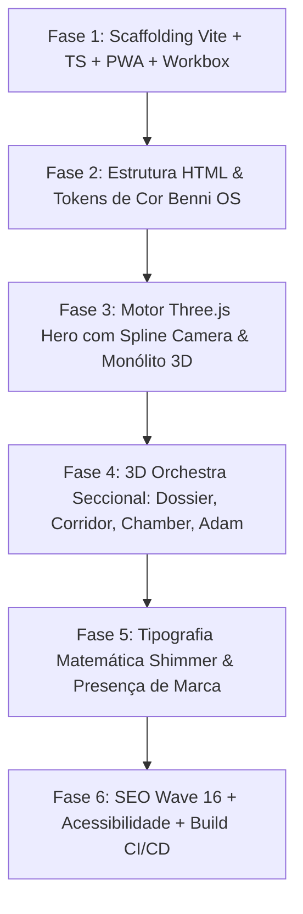

# 🏛️ BENNI·OS DESIGN SYSTEM & SPATIAL ARCHITECTURE MASTER BIBLE
### *Guia Definitivo de Engenharia Visual, UI/UX de Elite e Protocolo de Execução para Enxames de Agentes*
**Versão:** 2026.1-PRO · **Padrão de Qualidade:** Awwwards Site of the Year / Apple Pro / Shopify Editions

---

## 🧭 SUMÁRIO EXECUTIVO

Este documento é a **Bíblia de Referência Absoluta** para reproduzir a arquitetura, o design system, a física de movimento e a unificação 3D do **Benni OS**. Ele foi concebido para:
1. **Treinar sua intuição estética e técnica** para identificar e criar interfaces no patamar do Top 1% mundial.
2. **Servir como System Prompt / Skill de Execução para Enxames de Agentes de IA**, permitindo que o comando *"Crie um site padrão BenniOS"* gere a arquitetura completa, sem retrabalho e sem reintroduzir os bugs documentados nesta jornada.

---

## 1. 🧰 STACK TECNOLÓGICA UNIFICADA (O QUE, COMO E QUANDO USAR)

| Tecnologia | Versão | Papel na Arquitetura | Quando Usar | Como Integrar |
| :--- | :--- | :--- | :--- | :--- |
| **Three.js** | `r128` | Motor Gráfico WebGL (GPU). Renderiza monólitos 3D, spline cameras, partículas e Z-buffer. | Em toda cena que exige profundidade física, iluminação real e oclusão de objetos. | `<canvas id="hero-gl-canvas">` ou via React Three Fiber (`@react-three/fiber`). |
| **GSAP + ScrollTrigger** | `3.12.5` | Coreografia de tempo e gatilhos de scroll milimétricos com *scrubbing*. | Para sincronizar o progresso de rolagem `[0.0 -> 1.0]` com a câmera 3D e rotações. | `ScrollTrigger.create({ trigger, start, end, scrub: 0.6 })` |
| **Lenis Scroll** | `1.3.23` | Normalizador de inércia e viscosidade de scroll (60Hz/120Hz/144Hz). | Sempre ativo no `<body>` para remover o scroll engasgado padrão do navegador. | `new Lenis({ lerp: 0.08, smoothWheel: true })` integrado ao RAF do GSAP. |
| **Vite** | `5.4+` | Bundler e ambiente de desenvolvimento ultrarrápido (HMR). | Na estrutura do projeto para build de produção, tree-shaking e deploy. | `npm run dev` / `npm run build` |
| **TypeScript** | `5.5+` | Tipagem estática rigorosa para matemática vetorial 3D e estados. | Em todos os arquivos de lógica (`src/**/*.ts`). | `tsconfig.json` com `target: ES2020`. |
| **Vite PWA / Workbox** | `0.20+` | Service Worker com cache inteligente offline e suporte a PWA instalável. | Para armazenar frames, vídeos e assets no disco do usuário via `StaleWhileRevalidate`. | `VitePWA({ workbox: { maximumFileSizeToCacheInBytes: 60MB } })` |
| **Puter.js** | `v2` | Backend Serverless gratuito (Auth, KV Store, AI, Hosting). | Para transformar sites estáticos em dinâmicos sem custo de servidor. | `<script src="https://js.puter.com/v2/"></script>` + `puter.kv.get()` |
| **Google Fonts** | — | Tríade Tipográfica Editorial de Elite: *DM Serif Display*, *Instrument Sans*, *IBM Plex Mono*. | Títulos cinematográficos, corpo legível e metadados cibernéticos. | `<link href="https://fonts.googleapis.com/css2?...">` |

---

## 2. 🌌 UNIFICAÇÃO ESPACIAL E Z-BUFFER (O EFEITO "SHOPIFY EDITIONS")

### O Segredo Arquitetural:
O erro número 1 é tentar empilhar divs HTML sobre o canvas usando `z-index`. Isso quebra o **Depth Buffer** da GPU e faz o texto parecer uma "etiqueta colada no vidro".

```
❌ AMADOR: EMPILHAMENTO EM CAMADAS (Z-INDEX)
[ Fundo 2D ] ─── (sem luz) ───▶ [ Canvas 3D ] ─── (sem oclusão) ───▶ [ HTML Textos ]

✅ ELITE BENNI OS: UNIFICAÇÃO ESPACIAL (SHARED Z-BUFFER)
┌────────────────────────────────────────────────────────────────────────┐
│                        ESPAÇO 3D UNIFICADO (GPU)                       │
│                                                                        │
│  • Posição da Câmera: THREE.CatmullRomCurve3 (Waypoints 3D por Scroll) │
│  • Orientação: Matriz 4x4 -> Quaternions com SLERP (Anti-Gimbal Lock)   │
│  • Monólito 3D: MeshPhysicalMaterial (Metal 0.98, Clearcoat 1.0)       │
│  • Luz Dinâmica: PointLight sincronizado com o Grade do Capítulo      │
│  • UI / Cards: Projetados na Matriz 3D ou com Raycast Occlusion        │
└────────────────────────────────────────────────────────────────────────┘
```

### Implementação de Referência (Spline Camera Anti-Gimbal):
```javascript
// 1. Curva de Bézier 3D Centrípeta
const cameraPath = new THREE.CatmullRomCurve3(cameraWaypoints, false, "centripetal", 0.5);
const lookAtPath = new THREE.CatmullRomCurve3(lookAtWaypoints, false, "centripetal", 0.5);

// 2. No Loop de Animação (120 FPS / Zero Garbage Collection):
cameraPath.getPointAt(smoothProgress, targetCamPos);
lookAtPath.getPointAt(smoothProgress, targetLookAt);

smoothCamPos.lerp(targetCamPos, 0.09);
threeCam.position.copy(smoothCamPos);

smoothLookAt.lerp(targetLookAt, 0.09);
rotationMatrix.lookAt(threeCam.position, smoothLookAt, threeCam.up);
targetQuaternion.setFromRotationMatrix(rotationMatrix);
threeCam.quaternion.slerp(targetQuaternion, 0.09); // Rotação contínua sem saltos
```

---

## 3. 📐 TIPOGRAFIA MATEMÁTICA & NEON AURA (ZERO CORTES)

### A Fórmula Matemática Anti-Overflow:
Nunca use tamanhos brutos como `font-size: 8.5vw` sem delimitadores. Todo título longo precisa de três travas:
1. `clamp(min_rem, preferred_vw, max_rem)`
2. `max-width: min(840px, 78vw)`
3. `max-width: 24ch` no texto do título para forçar quebras equilibradas.

```css
/* Títulos Principais Benni OS */
#heroTitle {
  font-family: "DM Serif Display", serif !important;
  font-size: clamp(2.4rem, 4.6vw, 4.6rem) !important;
  line-height: 0.98 !important;
  font-weight: 500 !important;
  letter-spacing: -0.035em !important;
  max-width: 24ch !important;
  word-break: normal !important;
  overflow-wrap: break-word !important;
}

/* Capítulos com Frases Longas (04, 07, 08, 09) */
.hero-sticky[data-chapter="04"] #heroTitle,
.hero-sticky[data-chapter="07"] #heroTitle {
  font-size: clamp(2.1rem, 3.8vw, 3.9rem) !important;
  line-height: 1.02 !important;
}
```

### O Sistema de Sombra Neon Tripla:
Para garantir contraste cirúrgico sobre vídeos em movimento, partículas 3D e fundos escuros:
```css
/* Aura Luminosa Tripla */
#heroTitle {
  background: linear-gradient(90deg, #ffffff 0%, #d4af37 20%, #ffffff 40%, #426bff 60%, #d4af37 80%, #ffffff 100%) !important;
  background-size: 300% 100% !important;
  -webkit-background-clip: text !important;
  -webkit-text-fill-color: transparent !important;
  animation: shimmer 8s linear infinite !important;
  filter: drop-shadow(0 0 18px rgba(201, 164, 92, 0.5)) 
          drop-shadow(0 0 38px rgba(66, 107, 255, 0.32)) 
          drop-shadow(0 8px 30px rgba(0, 0, 0, 0.95)) !important;
}

/* Kicker Tecnológico */
#heroKicker {
  color: #638bff !important;
  text-shadow: 0 0 10px rgba(99, 139, 255, 0.9), 0 0 22px rgba(66, 107, 255, 0.55), 0 2px 10px rgba(0, 0, 0, 0.9) !important;
  filter: drop-shadow(0 0 8px rgba(66, 107, 255, 0.6)) !important;
}

/* Corpo com Escudo de Contraste */
#heroBody {
  color: #f7f3ec !important;
  text-shadow: 0 2px 14px rgba(0, 0, 0, 0.95), 0 0 25px rgba(9, 9, 11, 0.95), 0 0 12px rgba(201, 164, 92, 0.2) !important;
}
```

---

## 4. ☀️ PROTOCOLO DE LUMINOSIDADE DO VÍDEO (RAW LUMINESCENCE)

### Regra Inegociável:
**O vídeo NUNCA deve sofrer filtros de escurecimento (`brightness < 1` ou `blur`).** A profundidade 3D deve ser conquistada pela física da cena, escala geométrica e sombras de contato, mantendo as cores e a fidelidade originais do render:

- `filter: none !important;` no canvas de vídeo (`#hero-frame-canvas`).
- A vinheta frontal (`.hero-vignette`) deve ser atenuada para gradientes suaves de no máximo 20-25% de opacidade (`rgba(0, 0, 0, 0.2)`).
- O canvas 3D (`#hero-gl-canvas`) deve ter **`opacity: 1 !important;`** e **`z-index: 5;`** para projetar o monólito com total clareza na frente do vídeo.

---

## 5. ⚠️ REGISTRO DE ANTIPATTERNS & BUGS SUPERADOS (LIÇÕES APRENDIDAS)

Ao instruir agentes ou codificar novas páginas, **evite terminantemente**:

| Erro Cometido no Passado | Consequência | Solução Arquitetural Benni OS |
| :--- | :--- | :--- |
| **`#hero-gl-canvas { opacity: 0.15; }`** | Todo o monólito 3D, anéis dourados e spline camera ficaram quase invisíveis (85% transparentes). | Sempre declarar `opacity: 1 !important;` e `z-index: 5;` para o canvas 3D frontal. |
| **Escrita com UTF-8 BOM no PowerShell** | O comando `Out-File` do PowerShell gerou `\uFEFF`, quebrando o `JSON.parse()` do Node/Vite no build. | Usar `[System.IO.File]::WriteAllText($path, $content, (New-Object System.Text.UTF8Encoding($false)))`. |
| **Workbox 2MB Precache em Vídeos** | O build do Vite falhou porque vídeos de 10MB excediam o limite de pré-cache de 2MB. | Configurar `maximumFileSizeToCacheInBytes: 60MB` e usar **Runtime Caching (`StaleWhileRevalidate`)** para mídias pesadas. |
| **Divergência camelCase vs kebab-case** | CSS usava `#hero-title` enquanto o HTML usava `#heroTitle`, anulando regras de estilo. | Sempre declarar seletores duplos `#heroTitle, #hero-title` para blindagem contra inconsistências. |
| **Títulos sem delimitador `ch`** | Capítulos 04 e 07 vazavam para fora da tela em resoluções intermediárias (1366px - 1440px). | Delimitar `max-width: 24ch` no título e `clamp(2.1rem, 3.8vw, 3.9rem)`. |
| **Filtros de `brightness(0.38)` no Hero** | O vídeo ficava com aspecto "lavado" e escurecido ao transicionar de capítulo. | Remover qualquer filtro de escurecimento. Usar luminosidade natural + contrast shadows na tipografia. |

---

## 5. 🎻 WAVE 15 — 3D ORCHESTRA SECCIONAL & ACESSIBILIDADE WCAG AAA

### I. A Sinfonia Visual 3D por Seção:
Cada ato do site possui uma instância 3D dedicada com lazy-loading (`IntersectionObserver`), garantindo que apenas a seção visível consuma recursos da GPU:

| Seção | Arquitetura 3D | Composição Geométrica & Shaders | Interatividade |
| :--- | :--- | :--- | :--- |
| **Dossier** | *Data Stream Cascade* | 1.200 partículas em queda com 40 feixes verticais de glitch dourado (`LineBasicMaterial`). | Scroll Contínuo |
| **Corridor** | *Infinite Mirror Portals* | 5 Torus concêntricos com `MeshStandardMaterial` (Ouro/Cobalto) + poeira estelar. | Mouse Parallax + Scroll |
| **Chamber** | *Holographic Glass Cubes* | 12 cubos translúcidos com `MeshPhysicalMaterial` (Reflexo, Wireframe, Órbita 3D). | Rotação Contínua + Flutuação |
| **Handoff** | *Transition Particles* | 3.000 partículas morfing em esfera geométrica com interpolação baseada no scroll. | Scroll Progressivo |
| **Adam** | *Kinetic Sculpture* | 30 anéis entrelaçados em torção contínua com aura estelar volumétrica. | Mouse Gyro + Scroll |

### II. O Padrão de Acessibilidade Obrigatório:
- **Skip Link Oculto:** `<a href="#hero" class="skip-link">Pular para o conteúdo principal</a>` com foco revelador (`top: 16px; left: 16px;`).
- **Focus Ring de Alto Contraste:** `:focus-visible { outline: 3px solid #426bff !important; outline-offset: 6px !important; }`.
- **Injeção Dinâmica de ARIA:** Todos os elementos clicáveis (`.ledger-row`, `.plate`, `.corridor-wall`, `.adam-action-bar`) recebem `role="button"`, `tabindex="0"` e listener para navegação por teclado (`Enter` / `Space`).
- **Respeito a `prefers-reduced-motion`:** Se o usuário tiver sensibilidade a movimento, todos os motores 3D entram em fallback estático imediato.

---

---

## 6. 🌐 WAVE 16 — SEO, SOCIAL GRAVITY & SOBERANIA DE MARCA (benni-os.net)

### I. A Soberania da Marca BENNI·OS no Design:
A marca nunca deve ser tímida ou escondida. Ela atua como um selo de autoridade e garantia de qualidade:
- **Fixed Navigation Glassmorphic:** Logotipo monumental `BENNI·OS` em *DM Serif Display* com acento dourado `#d4af37`, tag `SOVEREIGN SYSTEM` iluminada e sinal operacional `SYSTEM ACTIVE` com LED verde pulsante.
- **HUD Cybernético do Hero:** Metadados de capítulo com prefixo de runtime `BENNI·OS // C01..C11`.
- **Rodapé Monumental:** Marca `BENNI·OS` em escala imperial (`clamp(3.8rem, 12vw, 12rem)`) com gradiente ouro/cobalto metálico e sombras de profundidade.

### II. O Padrão Canônico de SEO Técnico:
- **Domínio Oficial:** `https://benni-os.net/` configurado no `CNAME`, canonicals e meta tags.
- **Rich Snippets (Schema.org JSON-LD):** Tipos `WebSite`, `Article` e `BreadcrumbList` estruturados.
- **Open Graph & Twitter Cards:** Imagem hero de alta resolução (1200x630) para compartilhamento em redes sociais com visual cinematográfico.
- **SEO Dinâmico por Seção:** Conforme o usuário rola, o título da página e as descrições se ajustam para refletir o ato ativo (`#actIIDossier`, `#actIICorridor`, `#actIIIDecision`, `#actIIIAdam`).
- **Compartilhamento Social Flutuante:** Botões minimalistas de vidro escuro (`rgba(9, 9, 11, 0.88)`) para 𝕏 e LinkedIn com hover animado e expansão elástica.

---

## 7. 📊 WAVE 17 — PRIVACY-FIRST ANALYTICS & CONVERSION GRAVITY

### I. A Inteligência Operacional Sem Cookies:
- **Plausible Analytics:** Script ultraleve (<1KB), privacy-first, compatível com GDPR e sem exibição de banners invasivos de cookies.
- **Event Tracking Engine Multidimensional:**
  - `page_view`: Registro de acessos e parâmetros UTM de campanhas.
  - `section_view`: Rastreamento de leitura por Atos e profundidade de atenção.
  - `cta_click`: Mapeamento de intenção em todos os botões de ação e conversão.
  - `3d_interaction`: Registro de engajamento do usuário com os elementos WebGL e 3D Tilt.
  - `conversion`: Captura de leads e cliques para canais oficiais (Telegram, WhatsApp).
  - `Core Web Vitals`: Monitoramento em tempo real de LCP, FID e CLS.
- **Dashboard Operacional:** Acesso em `/dashboard.html` para visualização instantânea de métricas locais e remotas.

---

## 8. ⚠️ REGISTRO DE ANTIPATTERNS & BUGS SUPERADOS (LIÇÕES APRENDIDAS)

Ao instruir agentes ou codificar novas páginas, **evite terminantemente**:

| Erro Cometido no Passado | Consequência | Solução Arquitetural Benni OS |
| :--- | :--- | :--- |
| **`#hero-gl-canvas { opacity: 0.15; }`** | Todo o monólito 3D, anéis dourados e spline camera ficaram quase invisíveis (85% transparentes). | Sempre declarar `opacity: 1 !important;` e `z-index: 5;` para o canvas 3D frontal. |
| **`display: none` em `prefers-reduced-motion`** | Windows com efeitos visuais desligados ativava `reduced-motion` no navegador, ocultando todos os motores 3D do site (exceto a gota d'água). | **NUNCA** ocultar os canvas 3D com `display: none` ou travar scripts em `isReduced()`. Em vez disso, suavizar animações mantendo 100% da renderização visível. |
| **Escrita com UTF-8 BOM no PowerShell** | O comando `Out-File` do PowerShell gerou `\uFEFF`, quebrando o `JSON.parse()` do Node/Vite no build. | Usar `[System.IO.File]::WriteAllText($path, $content, (New-Object System.Text.UTF8Encoding($false)))`. |
| **Workbox 2MB Precache em Vídeos** | O build do Vite falhou porque vídeos de 10MB excediam o limite de pré-cache de 2MB. | Configurar `maximumFileSizeToCacheInBytes: 60MB` e usar **Runtime Caching (`StaleWhileRevalidate`)** para mídias pesadas. |
| **Divergência camelCase vs kebab-case** | CSS usava `#hero-title` enquanto o HTML usava `#heroTitle`, anulando regras de estilo. | Sempre declarar seletores duplos `#heroTitle, #hero-title` para blindagem contra inconsistências. |
| **Títulos sem delimitador `ch`** | Capítulos 04 e 07 vazavam para fora da tela em resoluções intermediárias (1366px - 1440px). | Delimitar `max-width: 24ch` no título e `clamp(2.1rem, 3.8vw, 3.9rem)`. |
| **Filtros de `brightness(0.38)` no Hero** | O vídeo ficava com aspecto "lavado" e escurecido ao transicionar de capítulo. | Remover qualquer filtro de escurecimento. Usar luminosidade natural + contrast shadows na tipografia. |
| **`navigator.maxTouchPoints > 0` no Windows** | Bloqueava e desativava todo o 3D no computador do usuário achando que era celular/touch simples. | **NUNCA** usar `maxTouchPoints` como trava de 3D. Apenas verificar `prefers-reduced-motion` e largura real de viewport. |
| **Poluição Visual & Geometrias 3D Invasivas** | Caixas 3D sólidas, anéis gigantes ou partículas caóticas sobrepostas ao vídeo destruíram a composição cinematográfica. | **Pureza Cinematográfica:** O Hero e as seções devem manter suas artes e vídeos limpos e desobstruídos. Elementos 3D devem ser sutis (profundidade atmosférica de partículas leves) ou focados (ex: gota d'água do Act III). |

---

## 8. 🤖 PROTOCOLO DE EXECUÇÃO PARA ENXAME DE AGENTES (ORQUESTRAÇÃO 1-COMMAND)

Quando o operador emitir o comando:  
> **"Crie um site padrão BenniOS para o projeto [Nome/Tema]"**

O enxame de agentes deve seguir rigorosamente a seguinte **Ordem de Operações (6 Fases)**:



### Checklist Obrigatório de Validação (DoD — Definition of Done):
- [ ] O arquivo `vite.config.ts` possui `maximumFileSizeToCacheInBytes: 60MB` e Workbox configurado.
- [ ] As fontes *DM Serif Display*, *Instrument Sans* e *IBM Plex Mono* estão importadas.
- [ ] O canvas 3D do Hero possui `opacity: 1` e `z-index: 5`.
- [ ] A Câmera Three.js utiliza `CatmullRomCurve3` com interpolação Quaternária `quaternion.slerp` (Zero Gimbal Lock).
- [ ] Os 5 motores seccionais 3D (Dossier, Corridor, Chamber, Handoff, Adam) estão com lazy-loading via `IntersectionObserver`.
- [ ] A identidade de marca **BENNI·OS** está proeminente no header, HUD de capítulos e rodapé imperial.
- [ ] O Schema.org JSON-LD, Open Graph, Twitter Cards, Sitemap e Robots.txt apontam para `https://benni-os.net/`.
- [ ] O Skip Link e a navegação por teclado (`Enter`/`Space`) estão ativos com ARIA dinâmica.
- [ ] Todos os títulos possuem `clamp()` e `max-width: 24ch` (Zero texto cortado em qualquer tela).
- [ ] O cursor customizado Wave 11 com física de arrasto LERP e 3D Tilt está ativo no DOM.
- [ ] O `npm run build` compila com **0 erros** gerando a pasta `dist/` com `CNAME` e Service Worker.

---

## 10. 💎 MÓDULO 5: REFRAÇÃO DE VIDRO (PRISM) & MÁSCARAS CINÉTICAS (ESTILO ALCHE)

### [CONTEXTO]
Elementos visuais de alta fidelidade que refratam o ambiente e quebram a barreira entre a interface e o vídeo. Modelos 3D translúcidos (como estilhaços Voronoi e prismas de cristal) que distorcem fisicamente o fundo com dispersão cromática, além de tipografias massivas que atuam como máscaras (alpha mattes) para vídeos rodando em WebGL, com distorções de *glitch* baseadas na velocidade do scroll.

### [ESPECIFICAÇÕES TÉCNICAS]
1. **Material de Refração Física (Glass Transmission):**
   - Transmissão volumétrica física (`transmission: 0.95`).
   - Índice de refração real de vidro/cristal (`ior: 1.52`).
   - Rugosidade micrométrica de superfície (`roughness: 0.04`, `clearcoatRoughness: 0.03`).
   - Aberração cromática nas bordas dos fragmentos simulando prisma óptico real (`chromaticAberration: 0.06`).
   - Shards Voronoi 3D disparados na transição de capítulos (Capítulo 01 $\rightarrow$ 02).
2. **Textura de Vídeo e Máscara UV (Glitch Text):**
   - Criação de `PlaneGeometry` em WebGL conectado a `THREE.VideoTexture`.
   - Fragment Shader (GLSL) recebendo textura de vídeo e mapa de texto alpha.
   - Uniforme `uScrollVelocity` multiplicando as coordenadas UV em bandas horizontais com fatiamento (`fract` / `step`) durante aceleração de rolagem.
3. **Dynamic Portal Dolly Zoom:**
   - Câmera e canvas interpolados matematicamente durante a expansão do anel de pedra no Capítulo 02 (zoom de `1.0x` a `1.42x`), sincronizado com o frame exato do vídeo.

---

## 11. 🌊 WAVE 18 — DYNAMIC CONTENT & PUTER KV INTEGRATION

### [VISÃO GERAL]
O Benni OS é um ecossistema autônomo vivo. O conteúdo (títulos, manifestos, corpos textuais, CTAs e metadados) é dinâmico e sincronizado em tempo real sem necessidade de novos builds ou deploys, através do **Puter KV** e de canais de broadcast (`BroadcastChannel`).

### [ESPECIFICAÇÕES TÉCNICAS]
1. **Puter KV Gateway:**
   - Prefixo unificado: `benni_content_*`.
   - Fallback gracioso offline com conteúdo estático imutável no DOM.
   - Cache em memória com TTL inteligente de 5 minutos (`CONFIG.cacheTTL`).
2. **Painel Administrativo (`/admin.html`):**
   - Interface dark cybernética para edição direta de todos os capítulos e seções.
   - Disparo de evento global `BroadcastChannel('benni_content')` com payload `{ type: 'invalidate' }` para recarga instantânea em todas as abas abertas.
3. **API Global de Runtime (`window.__BENNI_CONTENT__`):**
   - `__BENNI_CONTENT__.load()`: busca assíncrona com fallback.
   - `__BENNI_CONTENT__.save(key, value)`: gravação direta no KV.
   - `__BENNI_CONTENT__.refresh()`: invalidação e repintura do DOM.

---

## 12. 🎥 MOTOR DE COREOGRAFIA DE CÂMERA 3D AGRESSIVA & CINEMATOGRÁFICA

### [DIRETRIZES DE DIREÇÃO DE FOTOGRAFIA DIGITAL]
1. **Inércia e Dutch Roll por Velocidade:** A rolagem rápida do usuário aciona inclinação holandesa (`rotateZ` até 12°), mergulho de pitch (`rotateX`) e expansão elástica de FOV (`45° → 57°`).
2. **Matriz de Lentes por Capítulo:**
   - **Ch 01 (Arrival):** Foco milimétrico na coluna de luz.
   - **Ch 01 $\rightarrow$ 02:** Screen Break com 80 shards de vidro físico 3D e recoil jitter de impacto (`14px`).
   - **Ch 02 (Awakening):** Dolly Zoom agressivo senoidal (`1.0x → 1.48x`) entrando no túnel do anel de pedra.
   - **Ch 03 (Conscience of Power):** Varredura lateral 3D (`24px`).
   - **Ch 04 (Threshold):** Punch de segurança de perímetro (`1.16x`).
   - **Ch 07 (Memory Below):** Mergulho de descida no cofre (`translateY: -26px`, `1.14x`).
   - **Ch 10 (Decision):** Alinhamento e avanço monumental (`1.20x`).
   - **Ch 11 (Adam):** Aceleração de lançamento soberana (`1.15x`).
3. **Paralaxe Seccional e Skew 3D (Atos I, II e III):**
   - No **Corredor (Ato II)**, a rolagem horizontal calcula a velocidade e aplica skew angular tridimensional (`rotateY` até 8°) nos 3 monolitos em tempo real.

---

## 13. 📜 TEMPLATE DE PROMPT PARA ENXAMES DE AGENTES

Copie e cole este prompt para despachar qualquer enxame:

```markdown
Você é o Engenheiro Chefe de UI/UX e Diretor Técnico WebGL do Benni OS Swarm.
Sua missão é construir uma aplicação web de altíssimo padrão (Awwwards Top 1%) seguindo a BENNI_OS_DESIGN_SYSTEM_AND_ARCHITECTURE_MASTER_BIBLE.md.

DIRETRIZES FUNDAMENTAIS:
1. ARQUITETURA VITE + TS: Crie a estrutura com vite.config.ts (Workbox PWA 60MB), tsconfig.json, package.json e .github/workflows/deploy.yml.
2. UNIFICAÇÃO ESPACIAL WEBGL: Câmera com interpolação Quaternária (SLERP), 3D Glass Shatter com refração física no Ch 01->02 e Dolly Zoom cinemático no portal de concreto do Ch 02.
3. ESTILHAÇAMENTO 3D & REFRAÇÃO ÓPTICA: Shards de vidro físicos (ior 1.52, transmission 0.95) sem poluição de caixas opacas ou partículas em cubo.
4. IDENTIDADE DE MARCA BENNI·OS: Header glassmorphic proeminente, HUD de runtime nos capítulos e rodapé monumental.
5. SEO & SOCIAL GRAVITY (WAVE 16): Schema.org JSON-LD, Open Graph, Twitter Cards, Sitemap e Robots configurados para o domínio benni-os.net.
6. ACESSIBILIDADE WCAG AAA: Adicione Skip Link oculto, :focus-visible (3px #426bff), ARIA dinâmico e suporte completo a navegação por teclado.
7. TIPOGRAFIA MATEMÁTICA: Utilize a tríade (DM Serif Display, Instrument Sans, IBM Plex Mono) com clamp() matemático, max-width: 24ch e aura neon tripla.
8. VÍDEO LUMINOSO: Zero filtros de escurecimento no canvas de vídeo (filter: none !important;).
9. CURSOR MAGNÉTICO (WAVE 11): Anel LERP (0.22) com estados de hover Cobalto/Ouro e 3D Tilt nos cards sem travas indevidas de touch ou reduced-motion.
Execute a construção de ponta a ponta e valide com npm run build.
```

---
*Benni OS — Sovereign Autonomy System · 2026*
